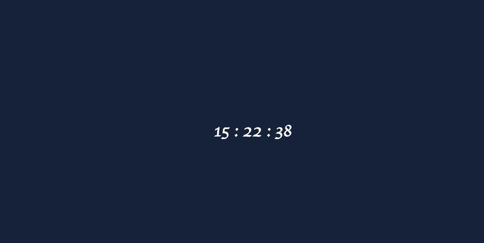

# Day 1 - Hex Color Clock

For today I wanted to make a simple idea I've had for a while now. Hex colors are 6 characters long (not including the octothorpe), and so is time when formatted in **hr:min:sec.**
Essentially, if the time is 10:43:22 then the background color will be the hex value for #104342. HTML templating was done with Jade and styling with Stylus.

