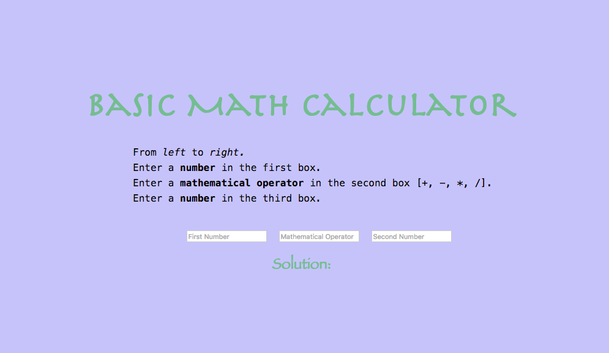
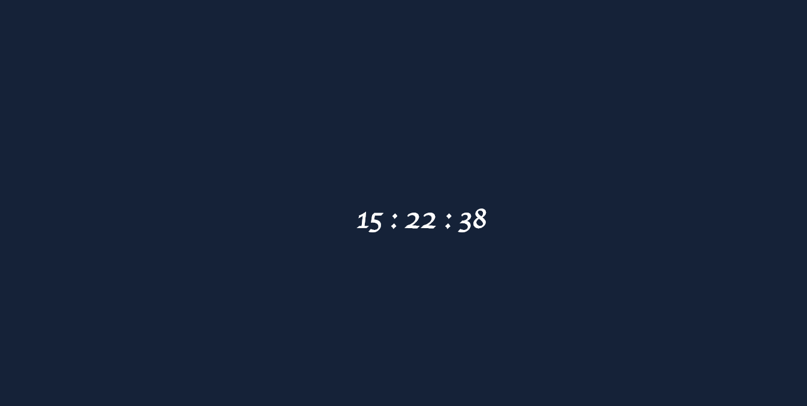

# 100-Days-Of-Code
Personal challenge to code up a small hack for 100 "consecutive" days

| Day  | Project                 | Picture               |
|------|-------------------------|-----------------------|
| 0    | Calculator              |   |
| 1    | Hex Background Clock    |   |
| 2    | BBCode2HTML             |  |
| 3    | DNA <=> RNA Converter   |   |
| 4    | Under Construction Page |   |
